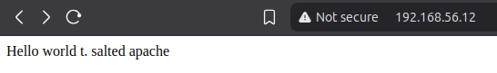

# h4 Pkg-file-service
Tehtävänanto: Tero Karvinen, Palvelinten Hallinta, https://terokarvinen.com/palvelinten-hallinta/

*Päivitys 20.04.*: Kiitos erinomaisesta palautteesta! Olen päivittänyt kohdat 
jotka vaativat päivitystä, ja poistanut hieman turhia pätkiä edellä olevasta 
kannanotosta.

> https://meta.stackoverflow.com/questions/285551/why-should-i-not-upload-images-of-code-data-errors
>
> You should not post code (or errors/exceptions, logs, configuration, project files, commands typed at a terminal prompt, or anything else that is represented in textual form) as an image because:
>
> - Images cannot be interpreted by screen readers, making them completely inaccessible for users with visual impairments.
> - Code or sample data in images can't be copied and pasted into an editor and compiled in order to reproduce the problem.
> - Images are large and hard to read on mobile devices, and often cost mobile users valuable data.
> - Images can be blocked by corporate proxies, certain school networks, and entire countries (notably China), and therefore the code isn't available to those readers.
> - Images can't be searched and therefore aren't useful to future readers or even present readers using Ctrl+F.
> - ja muitakin syytä

Jos mielestänne teksti- tai koodiblokit ovat epäselviä tai vaikeaa luettavaa, niin antakaa rakentavaa palautetta, 
mitä mielestänne olisi kivempi lukea (kuvat eivät tee koodien sisällöstä selkeämpää). 

Tulisiko esim. koodipätkät pilkkoa enemmän, vai pitäisikö niitä kommentoida tiheämmin? 

Jos epäilette, että tehtävää ei ole oikeasti tehty, niin ottakaa yhteys kurssinvetäjään, jonka vastuulla on selvittää vilppitilanteet.

## Tehtävä x)
> Lue ja tiivistä. (Tässä x-alakohdassa ei tarvitse tehdä testejä tietokoneella, vain lukeminen tai kuunteleminen ja tiivistelmä riittää. Tiivistämiseen riittää muutama ranskalainen viiva. Ei siis vaadita pitkää eikä essee-muotoista tiivistelmää. Lisää kuhunkin jokin oma kysymys tai huomio.)

Tämän artikkelin perusteella saadaan apuja b-kohtaan, jossa sshdemoni ajetaan pystyyn saltin orjalla portissa 8888. Artikkeli antaa hyvän idean siitä, 
kuinka yksinkertainen rakenne sls:llä voi olla pkg-file-service -rakenteella.

## Tehtävä a)
> Apache easy mode. Asenna Apache, korvaa sen testisivu ja varmista, että demoni käynnistyy.

(Päivitetty 20.04 sana lisätty **boldattuna**)
Apache asennettu ja etusivu muutettu jo **käsin** aikaisemmin edellisellä kurssilla[^1] 

Tein tehtävää varten `easyapache.sls`än, aikalailla ulkomuistista sen perusteella
mitä tiedän, että normaali apachen ajo ja weppisivun pystytys vaatii, mutta tällä
kertaa salttiversiona.
```bash
lemonish@xdd:/srv/salt$ cat easyapache.sls 
```
```yaml
apache2-pkg:
  pkg.installed:
    - name: apache2

/etc/apache2/sites-available/salted-apache.com.conf:
  file.managed:
    - source: salt://salted-apache.com.conf

/var/www/salted-apache.com/index.html:
  file.managed:
    - source: salt://index.html

apache2-service:
  service.running:
    - name: apache2
    - watch:
      - file: /etc/apache2/sites-available/salted-apache.com.conf
```
perusmuotoinen VirtualHostia varten apache conffi. tuttu linux-palvelimet 
-kurssilta.[^1]
```
lemonish@xdd:/srv/salt$ cat salted-apache.com.conf 
<VirtualHost *:80>
    ServerName salted-apache.com
    DocumentRoot /var/www/salted-apache.com
</VirtualHost>

lemonish@xdd:/srv/salt$ cat index.html 
Hello world t. salted apache
```
```bash
lemonish@xdd:/srv/salt$ sudo salt "*" state.apply easyapache                         
salt-slave-vm:                            
## silmänvaivaa
## silmänvaivaa
----------                                                                                                                                                                
          ID: /var/www/salted-apache.com/index.html                                                                                                                       
    Function: file.managed                                                                                                                                                
      Result: False                                                                                                                                                       
     Comment: Parent directory not present                                                                                                                                
     Started: 15:46:01.965305                                                        
    Duration: 13.189 ms                                                                                                                                                   
     Changes:                                                                                                                                                             
----------
## silmänvaivaa
## silmänvaivaa
Summary for salt-slave-vm
------------                              
Succeeded: 3 (changed=3)
Failed:    1                              
------------                              
Total states run:     4
Total run time:   4.967 s
ERROR: Minions returned with non-zero exit code
```
unohtui laittaa file.managedille vielä erikseen viime viikolta tuttu `makedirs: True`.
Lisätään se 

<details><summary>HUOM: Päivitys 20.04. (klikkaa auki)</summary>

***
Korjaan virheen, jossa minulta jäi lisäämättä nyt lopullinen easyapache.sls-tiedosto. 
    Huom. myös päivitetty hakemistorakenne, ks. loput päivitykset.

```yaml
apache2-pkg:
  pkg.installed:
    - name: apache2

/etc/apache2/sites-available/salted-apache.com.conf:
  file.managed:
    - source: salt://apache/salted-apache.com.conf

/var/www/salted-apache.com/index.html:
  file.managed:
    - source: salt://apache/index.html
    - makedirs: True

disable_default_site:
  apache_site.disabled:
    - name: 000-default

enable_salted-apache_site:
  apache_site.enabled:
    - name: salted-apache.com

apache2-service:
  service.running:
    - name: apache2
    - watch:
      - file: /etc/apache2/sites-available/salted-apache.com.conf
      - apache_site: disable_default_site
      - apache_site: enable_salted-apache_site
```
***
</details>

ja ajetaan perus ajokomento taas
```
lemonish@xdd:/srv/salt$ sudo salt "*" state.apply easyapache
```

Tämän jälkeen kävin tarkistamassa mitä apache palvelee kotiosoitteessa. 
näköjään unohtui disabloida default saitti ja enabloida oma saitti, koska 
nyt kun käy tarkastelemassa weppisivua, niin sieltä tulee apachen perussivu. 
Tiedätte varmaan miltä se näyttää, niin en lisää siitä kuvaa pidentämään tätä raporttia.

Tutkitaampa miten sivu otetaan pois käynnistä saltilla..[^3]
>Enable and disable apache sites.
>
>```
>Enable default site:
>  apache_site.enabled:
>    - name: default
>
>Disable default site:
>  apache_site.disabled:
>    - name: default
>```

päädyin edellä olevan ohjeen myötä tämänkaltaiseen sls tiedoston lisäykseen
```yaml
# nämä lisätty
disable_default_site:
  apache_site.disabled:
    - name: 000-default

# nämä lisätty
enable_salted-apache_site:
  apache_site.enabled:
    - name: salted-apache.com

apache2-service:
  service.running:
    - name: apache2
    - watch:
      - file: /etc/apache2/sites-available/salted-apache.com.conf
      - apache_site: disable_default_site # nämä lisätty
      - apache_site: enable_salted-apache_site # nämä lisätty
```

eli ohjeen mukaan otetaan saltfunkkarilla pois päältä perussivun nimi 
(muistan sen olevan 000-default edelliseltä kurssilta) ja sitten oman sivun 
nimelle sama enable funkkari..

Nyt testataan
```
lemonish@xdd:/srv/salt$ sudo salt "*" state.apply easyapache                         
```

ja weppisivu näyttää toimivan

```bash
lemonish@xdd:/srv/salt$ curl 192.168.56.12
Hello world t. salted apache
```



## Tehtävä b)
> SSHouto. Lisää uusi portti, jossa SSHd kuuntelee.

<details><summary>HUOM: Päivitys 20.04. (klikkaa auki)</summary>

***
Testasin uudella orjalla sshn toimimattomuuden, sitten ajoin `sshd.sls` ja 
testaan uudelleen.

```bash
lemonish@xdd:/srv/salt$ nc -vz 192.168.56.13 8888
nc: connect to 192.168.56.13 port 8888 (tcp) failed: Connection refused
```

```bash
lemonish@xdd:~/vagrantboxes/debian12SingleSlaveTest$ sudo salt "test-slave-vm" state.apply sshd.sshd        
test-slave-vm:                            
----------                                
...snip...
----------                                                                           
          ID: /etc/ssh/sshd_config        
    Function: file.managed                                                          
      Result: True                                                                   
     Comment: File /etc/ssh/sshd_config updated                                      
     Started: 09:13:46.041365                                                        
    Duration: 13.176 ms                                                                                                                                                   
     Changes:                                                                                                                                                             
              ----------                  
              diff:                                                                                                                                                       
...snip...
                  -#Port 22                                                          
                  +Port 8888              
...snip...
----------                                
          ID: sshd                                                                  
    Function: service.running
      Result: True                        
     Comment: Service restarted
     Started: 09:13:46.082883
    Duration: 51.386 ms
     Changes:                             
              ----------
              sshd:                       
                  True

Summary for test-slave-vm
------------                              
Succeeded: 3 (changed=2)
Failed:    0                              
------------                              
Total states run:     3
Total run time:  75.568 ms
```

Kokeillaan edellinen netcat uudelleen
```bash
lemonish@xdd:/srv/salt$ nc -vz 192.168.56.13 8888
Connection to 192.168.56.13 8888 port [tcp/*] succeeded!
```
***
</details>

Tämän teinkin melkein täysin Teron ohjeiden mukaan[^2] jo aikaisemmin, kun siitä oli
x-kohdassa artikkeli.

Opittiin jollakin Teron tunnilla tuo hieno grep komento, joka piilottaa kaikki kommentit
sekä tyhjät rivit. On kätevä tuon sshd_configin lukuun catilla.
```bash
lemonish@xdd:/srv/salt$ cat sshd_config | grep -vE "^(#|$)"
Include /etc/ssh/sshd_config.d/*.conf
Port 8888
KbdInteractiveAuthentication no
UsePAM yes
X11Forwarding yes
PrintMotd no
AcceptEnv LANG LC_*
Subsystem       sftp    /usr/lib/openssh/sftp-server
```
eli tuon näköisen sshd_configin saan (+ lisätty port 8888) kun openssh-server 
ensimmäisenä asennetaan koneelle. Annan tuon suoraan sitten orjalle.

Seuraavanlainen sls-tiedosto kirjoitettu tehtävää varten, taitaa olla suoraan
Teron ohjeesta[^2].
```yaml
openssh-server:
  pkg.installed

/etc/ssh/sshd_config:
  file.managed:
    - source: salt://sshd_config

sshd:
  service.running:
    - watch:
      - file: /etc/ssh/sshd_config
```

sitten ajetaan saltilla komento.
```
lemonish@xdd:/srv/salt$ sudo salt "*" state.apply sshd                                                                                                    
```

En muistanut minkä ip:n takana host only vagrant oli, tarkastetaan `hostname -I`
```bash
lemonish@xdd:/srv/salt$ sudo salt "*" state.single cmd.run "hostname -I"
salt-slave-vm:
### silmänvaivaa
### silmänvaivaa
              stdout:
                  10.0.2.15 192.168.56.12 # otetaan ei natattu ip
### silmänvaivaa
### silmänvaivaa
```

eli iippari oli `192.168.56.12` testaan kuunteleeko sshd portin 8888 takana netcatilla.

Netcatin `-vz` lippu tuottaa verbose eli luettavampaa tekstiä, sekä skannaa vain kuuntelevan demonin[^4]
```bash
lemonish@xdd:/srv/salt$ nc -vz 192.168.56.12 8888
Connection to 192.168.56.12 8888 port [tcp/*] succeeded!
```
näyttää toimivan!

## Tehtävä c)
> Vapaaehtoinen, haastavahko tässä vaiheessa: Asenna ja konfiguroi Apache ja Name Based Virtual Host. Sen tulee näyttää palvelimen etusivulla weppisivua. Weppisivun tulee olla muokattavissa käyttäjän oikeuksin, ilman sudoa.

<details><summary>HUOM: Päivitys 20.04. (klikkaa auki)</summary>

***

Näköjään tosiaan haluttiin, että weppisivu on muokattavissa orjan koneella käyttäjäoikeuksilla,
mikä ei käynyt heti mielessä, kun kuvittelin että salt ajaa pääosin vain roottina käskyjä.
Oletin, että halutaan masterilla olevan käyttäjäoikeudet weppisivun editointiin.
Siksi tehtävänanto oli hieman vaikea ymmärtää. 

Oletetaan nyt, että saltilla setupataan kone jollekin toiselle henkilölle paketit ja 
weppisivu valmiina muokattavaksi. Nyt tosiaan täytyy index.html laittaa käyttäjän (vagrant)
kansioon. Ajoin tätä varten ylös kokonaan uuden orjan.

```bash
lemonish@xdd:~/vagrantboxes$ sudo salt-key -A
The following keys are going to be accepted:
Unaccepted Keys:
test-slave-vm
Proceed? [n/Y] y
Key for minion test-slave-vm accepted.
lemonish@xdd:~/vagrantboxes$ sudo salt "*" test.ping
test-slave-vm:
    True
salt-slave-vm:
    True
```

Korjataan `easyapache.sls`:n sisällöstä `/var/www` polku siten, että se osoittaakin
`/home/vagrant/public_sites/` hakemistoon.

```yaml
...snip...
/home/vagrant/public_sites/salted-apache.com/index.html:
  file.managed:
    - source: salt://apache/index.html
    - makedirs: True
...snip...
```

Säätämällä `top.sls`ään esim. seuraava
```yaml
base:
  'test-slave-vm':
    - packages.packages
    - sshd.sshd
    - apache.easyapache
```

voidaan nyt ajaa 
```bash
lemonish@xdd:~/vagrantboxes$ sudo salt "test-slave-vm" state.apply apache.easyapachetest-slave-vm:
----------                                
          ID: apache2-pkg                                                            
    Function: pkg.installed               
        Name: apache2                     
      Result: True                                                                   
     Comment: The following packages were installed/updated: apache2                 
     Started: 07:52:39.323154             
    Duration: 4723.004 ms                 
...snip...
----------                                                                                                                                                                
          ID: /home/vagrant/public_sites/salted-apache.com/index.html                                                                                                     
    Function: file.managed                                                                                                                                                
      Result: True                                                                                                                                                        
     Comment: File /home/vagrant/public_sites/salted-apache.com/index.html updated                                                                                        
     Started: 07:52:44.060412                                                                                                                                             
    Duration: 9.357 ms                                                                                                                                                    
     Changes:                                                                                                                                                             
              ----------                                                                                                                                                  
              diff:                                                                                                                                                       
                  New file                                                                                                                                                
              mode:                                                                                                                                                       
                  0644                                                                                                                                                    
----------    
...snip...
Summary for test-slave-vm
------------                              
Succeeded: 6 (changed=6)
Failed:    0                              
------------                              
Total states run:     6
Total run time:   5.164 s
```

Olettaa voisi jo suoraan, että kun salt ajaa komennot roottina, niin tuon tiedoston
mode on ihan oikea, mutta omistaja on väärä. Asetetaan sille vielä oikea omistaja 
    muokkaamalla edellä nähtyä easyapache.sls:ää.
 
```yaml
...snip...
/home/vagrant/public_sites/salted-apache.com/index.html:
  file.managed:
    - source: salt://apache/index.html
    - makedirs: True
    - user: vagrant
...snip...
```  

Ajamalla komento uusiksi saadaan

```bash
lemonish@xdd:~/vagrantboxes$ sudo salt "test-slave-vm" state.apply apache.easyapachetest-slave-vm:
...snip...
----------
          ID: /home/vagrant/public_sites/salted-apache.com/index.html
    Function: file.managed
      Result: True
     Comment: File /home/vagrant/public_sites/salted-apache.com/index.html updated
     Started: 08:04:01.617202
    Duration: 6.763 ms
     Changes:   
              ----------
              user:
                  vagrant
----------
...snip...
```

Käydään vielä testaamassa.

```bash
lemonish@xdd:/srv/salt$ curl -H "Host: salted-apache.com" http://192.168.56.13
<!DOCTYPE HTML PUBLIC "-//IETF//DTD HTML 2.0//EN">
<html><head>
<title>404 Not Found</title>
</head><body>
<h1>Not Found</h1>
<p>The requested URL was not found on this server.</p>
<hr>
<address>Apache/2.4.62 (Debian) Server at salted-apache.com Port 80</address>
</body></html>
```

Huomasin vielä unohtaneeni päivittää apachen conffit. Korjataan tiedosto 
`salted-apache.com.conf` seuraavanlaiseksi, jossa viittaus `/var/www/` on nyt 
`/home/vagrant/public_sites`.

```bash
<VirtualHost *:80>
    ServerName salted-apache.com
    DocumentRoot /home/vagrant/public_sites/salted-apache.com

    <Directory /home/vagrant/public_sites/salted-apache.com>
        AllowOverride None
        Require all granted
    </Directory>
</VirtualHost>
```

Testataan curlilla.

```bash
lemonish@xdd:/srv/salt$ curl 192.168.56.13
<!DOCTYPE HTML PUBLIC "-//IETF//DTD HTML 2.0//EN">
<html><head>
<title>403 Forbidden</title>
</head><body>
<h1>Forbidden</h1>
<p>You don't have permission to access this resource.</p>
<hr>
<address>Apache/2.4.62 (Debian) Server at 192.168.56.13 Port 80</address>
</body></html>
```

Tuleekin mielenkiintoinen ongelma, näköjään kun salt luo tiedoston ja makedirraa
hakemistot, niin se antaa halutut oikeudet ja omistajuudet vain tiedostolle, joten 
hakemistot tulisi tehdä ennen tiedoston asettamista, jolloin voidaan antaa niille 
oikeat oikeudet.

Korjataan siis edeltävää, ja lisätään vielä `file.directory`-osio vielä `easyapache.sls`:ään.
Siellä luodaan (jos ei ole olemassa) ja annetaan `755` oikeudet näille kansioille.
```yaml
...snip...
/home/vagrant:
  file.directory:
    - mode: 755
    - user: vagrant
    - group: vagrant

/home/vagrant/public_sites:
  file.directory:
    - mode: 755
    - user: vagrant
    - group: vagrant

/home/vagrant/public_sites/salted-apache.com:
  file.directory:
    - mode: 755
    - user: vagrant
    - group: vagrant

/home/vagrant/public_sites/salted-apache.com/index.html:
  file.managed:
    - source: salt://apache/index.html
    - mode: 644
    - user: vagrant
    - group: vagrant
...snip...
```

Nyt kansioissa pitäisi olla `rwxr-xr-x` oikeudet. Ajetaan vielä uusiksi tila 
ja tutkaillaan.

```bash
lemonish@xdd:~/vagrantboxes$ sudo salt "test-slave-vm" state.apply apache.easyapachetest-slave-vm:
...snip...
----------                                
          ID: /home/vagrant               
    Function: file.directory              
      Result: True                        
     Comment: Directory /home/vagrant updated                                        
     Started: 08:58:15.795142             
    Duration: 0.646 ms                    
     Changes:                                                                        
              ----------                  
              /home/vagrant:
                  ----------              
                  mode:                   
                      0755                                                           
              mode:                       
                  0755                    
----------                                                                           
          ID: /home/vagrant/public_sites  
    Function: file.directory              
      Result: True                        
     Comment:                             
     Started: 08:58:15.795827             
    Duration: 0.573 ms    
     Changes:                             
              ----------           
              /home/vagrant/public_sites: 
                  ----------
                  directory:              
                      new    
----------                                
          ID: /home/vagrant/public_sites/salted-apache.com                           
    Function: file.directory              
      Result: True                        
     Comment:                             
     Started: 08:58:15.796437             
    Duration: 0.59 ms                     
     Changes:                             
              ----------                  
              /home/vagrant/public_sites/salted-apache.com:                          
                  ----------              
                  directory:
                      new                 
----------
...snip...
```

Nyt pitäisi olla oikeat omistajat ainakin.. kokeillaan curli uudelleen
```bash 
lemonish@xdd:/srv/salt$ curl 192.168.56.13
Hello world t. salted apache
```

Ja tarkastetaan, että vagrant käyttäjä tosiaan voi muokata ja omistaa 
`index.html`:än
```bash
lemonish@xdd:~/vagrantboxes/debian12SingleSlaveTest$ vagrant ssh testslave
...snip...
vagrant@test-slave-vm:~$ whoami
vagrant
vagrant@test-slave-vm:~$ pwd
/home/vagrant
vagrant@test-slave-vm:~$ cd public_sites/salted-apache.com/
vagrant@test-slave-vm:~/public_sites/salted-apache.com$ vim index.html 
-bash: vim: command not found
vagrant@test-slave-vm:~/public_sites/salted-apache.com$ echo "testing testing.. hello world" > index.html
vagrant@test-slave-vm:~/public_sites/salted-apache.com$ curl localhost
testing testing.. hello world
```

Näyttää toimivan. Kiitos palautteesta! Alla vielä lopullinen `easyapache.sls` kaikkine 
    säätöineen.

```yaml
apache2-pkg:
  pkg.installed:
    - name: apache2

/etc/apache2/sites-available/salted-apache.com.conf:
  file.managed:
    - source: salt://apache/salted-apache.com.conf

/home/vagrant:
  file.directory:
    - mode: 755
    - user: vagrant
    - group: vagrant

/home/vagrant/public_sites:
  file.directory:
    - mode: 755
    - user: vagrant
    - group: vagrant

/home/vagrant/public_sites/salted-apache.com:
  file.directory:
    - mode: 755
    - user: vagrant
    - group: vagrant

/home/vagrant/public_sites/salted-apache.com/index.html:
  file.managed:
    - source: salt://apache/index.html
    - mode: 644
    - user: vagrant
    - group: vagrant

disable_default_site:
  apache_site.disabled:
    - name: 000-default

enable_salted-apache_site:
  apache_site.enabled:
    - name: salted-apache.com

apache2-service:
  service.running:
    - name: apache2
    - watch:
      - file: /etc/apache2/sites-available/salted-apache.com.conf
      - apache_site: disable_default_site
      - apache_site: enable_salted-apache_site
```
***
</details>

Jos ymmärsin tuon "Weppisivun tulee olla muokattavissa käyttäjän oikeuksin, ilman sudoa."
osan oikein, niin tässä pitäisi siis masterilla oleva index.html luultavasti 
olla käyttäjän omistuksessa, sekä muokattavissa ilman sudoa. Sehän hoituu helposti
asettamalla sille oikeat ownerit ja muut oikeudet.

/srv/saltin olen jo muutenkin asettanut käyttäjän omistukseen, joten sinne menevät
tiedostot ovatkin jo luontihetkellä myös käyttäjän omistuksessa. 
```bash
lemonish@xdd:/srv/salt$ ls -la
total 36
drwxr-xr-x 2 lemonish lemonish 4096 Apr 16 19:43 .
drwxr-xr-x 3 root     root     4096 Apr 10 21:09 ..
-rw-rw-r-- 1 lemonish lemonish  650 Apr 16 19:11 easyapache.sls
-rw-rw-r-- 1 lemonish lemonish   29 Apr 16 16:10 index.html # tätä katsotaan
-rw-rw-r-- 1 lemonish lemonish  395 Apr 11 18:33 packages.sls
-rw-rw-r-- 1 lemonish lemonish  227 Apr 16 19:43 salted-apache.com.conf
-rw-r--r-- 1 lemonish lemonish 3256 Apr 16 12:46 sshd_config
-rw-rw-r-- 1 lemonish lemonish  178 Apr 16 12:54 sshd.sls
-rw-rw-r-- 1 lemonish lemonish   57 Apr 16 16:13 top.sls
```
<details><summary>HUOM: Päivitys 20.04. (klikkaa auki)</summary>

***
Siistitty /srv/salt lisäämällä kansiot jokaiselle moduulille.

```bash
lemonish@xdd:/srv/salt$ ls
easyapache.sls  index.html  packages.sls  salted-apache.com.conf  sshd_config  sshd.sls  top.sls
lemonish@xdd:/srv/salt$ mkdir package apache sshd
lemonish@xdd:/srv/salt$ ls
apache  easyapache.sls  index.html  package  packages.sls  salted-apache.com.conf  sshd  sshd_config  sshd.sls  top.sls
lemonish@xdd:/srv/salt$ mv easyapache.sls apache/
lemonish@xdd:/srv/salt$ mv index.html apache/
lemonish@xdd:/srv/salt$ mv salted-apache.com.conf apache/
lemonish@xdd:/srv/salt$ mv sshd_config sshd/
lemonish@xdd:/srv/salt$ mv sshd.sls sshd/
lemonish@xdd:/srv/salt$ mv packages.sls package/
lemonish@xdd:/srv/salt$ ls -la
total 24
drwxr-xr-x 5 lemonish lemonish 4096 Apr 20 08:56 .
drwxr-xr-x 3 root     root     4096 Apr 10 21:09 ..
drwxrwxr-x 2 lemonish lemonish 4096 Apr 20 08:55 apache
drwxrwxr-x 2 lemonish lemonish 4096 Apr 20 08:56 package
drwxrwxr-x 2 lemonish lemonish 4096 Apr 20 08:56 sshd
-rw-rw-r-- 1 lemonish lemonish   57 Apr 16 16:13 top.sls
```

Tätä kautta myös päivitetty `top.sls`.
```yaml
base:
  '*':
    - packages.packages
    - sshd.sshd
    - apache.easyapache
```

Ja myös päivitettävä reitit conffeihin esim. sshd_config.

sshd.sls näyttää nyt tältä
```yaml
openssh-server:
  pkg.installed

/etc/ssh/sshd_config:
  file.managed:
    - source: salt://sshd/sshd_config

sshd:
  service.running:
    - watch:
      - file: /etc/ssh/sshd_config
```

Ja testataan vastaako orja tähän pyyntöön. Nyt täytyy myös sitten kutsua
tilaa hyvin vähän eri tavalla muodolla `kansio.tiedosto` 
(eli ei `state.apply sshd`, vaan `state.apply sshd.sshd`)

```bash
lemonish@xdd:~/vagrantboxes/debian12SingleSlave$ sudo salt "*" state.apply sshd.sshd
salt-slave-vm:
----------
          ID: openssh-server
    Function: pkg.installed
      Result: True
     Comment: All specified packages are already installed
     Started: 06:57:11.952864
    Duration: 10.432 ms
     Changes:   
----------
          ID: /etc/ssh/sshd_config
    Function: file.managed
      Result: True
     Comment: File /etc/ssh/sshd_config is in the correct state
     Started: 06:57:11.964037
    Duration: 11.528 ms
     Changes:   
----------
          ID: sshd
    Function: service.running
      Result: True
     Comment: The service sshd is already running
     Started: 06:57:11.976232
    Duration: 36.702 ms
     Changes:   

Summary for salt-slave-vm
------------
Succeeded: 3
Failed:    0
------------
Total states run:     3
Total run time:  58.662 ms
```
***
</details>

Name based virtual hostia ei voida ihan niin simppelisti kokeilla masterilla muuta kuin spooffaamalla
host headeri ja tarkistamalla reitittääkö apache pyynnön oikein.

Päivitin linux-palvelimet -kurssilla tehdyn ohjeen mukaisesti apachen conf
filen[^1]. lisäsin myös demoa varten osan conffiin siten, että kaikki muut
hostit osoittaa 404 sivulle (koska en laita default hakemistoon mitään sivua). 
Tämän pitäisi todistaa, että host headerin kanssa puljailu toimii.
```bash
lemonish@xdd:/srv/salt$ cat salted-apache.com.conf 
# virtualhost joka siirtää kaiken muun paitsi salted-apache.comiin menevät defaulttiin
# jota ei ole olemassa -> 404 
<VirtualHost *:80>
    ServerName default
    DocumentRoot /var/www/default

    <Directory /var/www/default>
        AllowOverride None
        Require all denied
    </Directory>
</VirtualHost>
# tämä palvelee salted-apache.comia pyytäville index.html joka on olemassa
<VirtualHost *:80>
    ServerName salted-apache.com
    DocumentRoot /var/www/salted-apache.com

    <Directory /var/www/salted-apache.com>
        AllowOverride None
        Require all granted
    </Directory>
</VirtualHost>
```

Sitten ajoin perus ajokomennon uusiksi saltilla

```bash
lemonish@xdd:/srv/salt$ sudo salt "*" state.apply easyapache
```

Nyt kokeillaan curlata tuota slaven ip:tä ja asettamalla sille headeriksi 
`Host: salted-apache.com`, jolloin pyynnön vastaanottaja luulee saavansa 
pyynnön tuolta verkkosivulta. jos apache reitittää pyynnöt oikein, tulisi sieltä
saada vastaukseksi sivun sisältö.

```bash
lemonish@xdd:/srv/salt$ curl -H "Host: salted-apache.com" http://192.168.56.12
Hello world t. salted apache
```

Ja nyt, jotta testataan ettei apache vain vastaa jokaiseen pyyntöön hello world..
```bash
lemonish@xdd:/srv/salt$ curl -H "Host: mitahansehorisee.com" http://192.168.56.12
<!DOCTYPE HTML PUBLIC "-//IETF//DTD HTML 2.0//EN">
<html><head>
<title>404 Not Found</title>
</head><body>
<h1>Not Found</h1>
<p>The requested URL was not found on this server.</p>
<hr>
<address>Apache/2.4.62 (Debian) Server at mitahansehorisee.com Port 80</address>
</body></html>
```

eli näyttää toimivan! Apache onnistuneesti reitittää `salted-apache.com` nimipalvelimelle
liikenteen oikeaan osoitteeseen.

# Ympäristötiedot

Löytyvät tämän github repon [environment.md-tiedostosta.](https://github.com/p-lemonish/course-palvelinten-hallinta/blob/main/environment.md)

# Viittaukset
[^1]: Patrik Mihelson-Adamson, h3, https://github.com/p-lemonish/course-linux-palvelimet/blob/main/wk3/raporttih3.md
[^2]: Tero Karvinen, Pkg-File-Service – Control Daemons with Salt – Change SSH Server Port, https://terokarvinen.com/2018/04/03/pkg-file-service-control-daemons-with-salt-change-ssh-server-port/?fromSearch=karvinen%20salt%20ssh
[^3]: Saltproject, salt.states.apache_site, https://docs.saltproject.io/en/latest/ref/states/all/salt.states.apache_site.html
[^4]: man7, ncat(1) — Linux manual page, https://man7.org/linux/man-pages/man1/ncat.1.html
