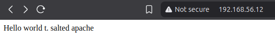

# h4 Pkg-file-service
Tehtävänanto: Tero Karvinen, Palvelinten Hallinta, https://terokarvinen.com/palvelinten-hallinta/

Tällä kurssilla on selkeästi henkilöitä jotka eivät lue raportteja loppuun. On jo pariin otteeseen valitettu,
että ympäristötietoja ei löydy. Katsokaapa uudestaan :).

Sitten pari sanaa kuvien käytöstä dokumentoinnissa. Kuvat teidän terminaali-ikkunoista eivät tee teidän raportista
yhtään sen todellisempaa, kuin terminaalin sisällön copy-pastettaessa tekstinä. Osat ovat palautteessaan väittäneet,
että kirjoitettu teksti ja komennot voivat tarkoittaa sitä, ettei tehtäviä oikeasti ole tehty (???). Jos haluatte 
syyllistää vilpistä, niin otatte yhteyttä opettajaan, ja asiaa sitten tutkitaan.

> https://meta.stackoverflow.com/questions/285551/why-should-i-not-upload-images-of-code-data-errors
>
> You should not post code (or errors/exceptions, logs, configuration, project files, commands typed at a terminal prompt, or anything else that is represented in textual form) as an image because:
>
> - Images cannot be interpreted by screen readers, making them completely inaccessible for users with visual impairments.
> - Code or sample data in images can't be copied and pasted into an editor and compiled in order to reproduce the problem.
> - Images are large and hard to read on mobile devices, and often cost mobile users valuable data.
> - Images can be blocked by corporate proxies, certain school networks, and entire countries (notably China), and therefore the code isn't available to those readers.
> - Images can't be searched and therefore aren't useful to future readers or even present readers using Ctrl+F.
> - ja miljoona muutakin syytä

Jos mielestänne teksti- tai koodiblokit ovat epäselviä tai vaikeaa luettavaa, niin antakaa rakentavaa palautetta, 
mitä mielestänne asialle tulisi tehdä (kuvat eivät tee koodien sisällöstä selkeämpää). Rakentava palaute ei ole 
"teksti oli vähän hankalaa luettavaa", koska se ei anna mitään referenssiä siitä, mihin verrattuna hankalaa. Onko 
se hankalaa, koska aihe on vaikea?

- x)
> Lue ja tiivistä. (Tässä x-alakohdassa ei tarvitse tehdä testejä tietokoneella, vain lukeminen tai kuunteleminen ja tiivistelmä riittää. Tiivistämiseen riittää muutama ranskalainen viiva. Ei siis vaadita pitkää eikä essee-muotoista tiivistelmää. Lisää kuhunkin jokin oma kysymys tai huomio.)

Tämän artikkelin perusteella saadaan apuja b-kohtaan, jossa sshdemoni ajetaan pystyyn saltin orjalla portissa 8888. Artikkeli antaa hyvän idean siitä, 
kuinka yksinkertainen rakenne sls:llä voi olla pkg-file-service -rakenteella.

- a)
> Apache easy mode. Asenna Apache, korvaa sen testisivu ja varmista, että demoni käynnistyy.

Apache asennettu ja etusivu muutettu jo aikaisemmin edellisellä kurssilla[^1] 

Tein tehtävää varten `easyapache.sls`än, aikalailla ulkomuistista sen perusteella
mitä tiedän, että normaali apachen ajo ja weppisivun pystytys vaatii, mutta tällä
kertaa salttiversiona.
```bash
lemonish@xdd:/srv/salt$ cat easyapache.sls 
```
```yaml
apache2-pkg:
  pkg.installed:
    - name: apache2

/etc/apache2/sites-available/salted-apache.com.conf:
  file.managed:
    - source: salt://salted-apache.com.conf

/var/www/salted-apache.com/index.html:
  file.managed:
    - source: salt://index.html

apache2-service:
  service.running:
    - name: apache2
    - watch:
      - file: /etc/apache2/sites-available/salted-apache.com.conf
```
perusmuotoinen VirtualHostia varten apache conffi. tuttu linux-palvelimet 
-kurssilta.[^1]
```
lemonish@xdd:/srv/salt$ cat salted-apache.com.conf 
<VirtualHost *:80>
    ServerName salted-apache.com
    DocumentRoot /var/www/salted-apache.com
</VirtualHost>

lemonish@xdd:/srv/salt$ cat index.html 
Hello world t. salted apache
```
```bash
lemonish@xdd:/srv/salt$ sudo salt "*" state.apply easyapache                         
salt-slave-vm:                            
## silmänvaivaa
## silmänvaivaa
----------                                                                                                                                                                
          ID: /var/www/salted-apache.com/index.html                                                                                                                       
    Function: file.managed                                                                                                                                                
      Result: False                                                                                                                                                       
     Comment: Parent directory not present                                                                                                                                
     Started: 15:46:01.965305                                                        
    Duration: 13.189 ms                                                                                                                                                   
     Changes:                                                                                                                                                             
----------
## silmänvaivaa
## silmänvaivaa
Summary for salt-slave-vm
------------                              
Succeeded: 3 (changed=3)
Failed:    1                              
------------                              
Total states run:     4
Total run time:   4.967 s
ERROR: Minions returned with non-zero exit code
```
unohtui laittaa file.managedille vielä erikseen viime viikolta tuttu `makedirs: True`.
Lisätään se ja ajetaan perus ajokomento taas
```
lemonish@xdd:/srv/salt$ sudo salt "*" state.apply easyapache
```

Tämän jälkeen kävin tarkistamassa mitä apache palvelee kotiosoitteessa. 
näköjään unohtui disabloida default saitti ja enabloida oma saitti, koska 
nyt kun käy tarkastelemassa weppisivua, niin sieltä tulee apachen perussivu. 
Tiedätte varmaan miltä se näyttää, niin en lisää siitä kuvaa pidentämään tätä raporttia.

Tutkitaampa miten sivu otetaan pois käynnistä saltilla..[^3]
>Enable and disable apache sites.
>
>```
>Enable default site:
>  apache_site.enabled:
>    - name: default
>
>Disable default site:
>  apache_site.disabled:
>    - name: default
>```

päädyin edellä olevan ohjeen myötä tämänkaltaiseen sls tiedoston lisäykseen
```yaml
# nämä lisätty
disable_default_site:
  apache_site.disabled:
    - name: 000-default

# nämä lisätty
enable_salted-apache_site:
  apache_site.enabled:
    - name: salted-apache.com

apache2-service:
  service.running:
    - name: apache2
    - watch:
      - file: /etc/apache2/sites-available/salted-apache.com.conf
      - apache_site: disable_default_site # nämä lisätty
      - apache_site: enable_salted-apache_site # nämä lisätty
```

eli ohjeen mukaan otetaan saltfunkkarilla pois päältä perussivun nimi 
(muistan sen olevan 000-default edelliseltä kurssilta) ja sitten oman sivun 
nimelle sama enable funkkari..

Nyt testataan
```
lemonish@xdd:/srv/salt$ sudo salt "*" state.apply easyapache                         
```

ja weppisivu näyttää toimivan

```bash
lemonish@xdd:/srv/salt$ curl 192.168.56.12
Hello world t. salted apache
```



- b)
> SSHouto. Lisää uusi portti, jossa SSHd kuuntelee.

Tämän teinkin melkein täysin Teron ohjeiden mukaan[^2] jo aikaisemmin, kun siitä oli
x-kohdassa artikkeli.

Opittiin jollakin Teron tunnilla tuo hieno grep komento, joka piilottaa kaikki kommentit
sekä tyhjät rivit. On kätevä tuon sshd_configin lukuun catilla.
```bash
lemonish@xdd:/srv/salt$ cat sshd_config | grep -vE "^(#|$)"
Include /etc/ssh/sshd_config.d/*.conf
Port 8888
KbdInteractiveAuthentication no
UsePAM yes
X11Forwarding yes
PrintMotd no
AcceptEnv LANG LC_*
Subsystem       sftp    /usr/lib/openssh/sftp-server
```
eli tuon näköisen sshd_configin saan (+ lisätty port 8888) kun openssh-server 
ensimmäisenä asennetaan koneelle. Annan tuon suoraan sitten orjalle.

Seuraavanlainen sls-tiedosto kirjoitettu tehtävää varten, taitaa olla suoraan
Teron ohjeesta[^2].
```yaml
openssh-server:
  pkg.installed

/etc/ssh/sshd_config:
  file.managed:
    - source: salt://sshd_config

sshd:
  service.running:
    - watch:
      - file: /etc/ssh/sshd_config
```

sitten ajetaan saltilla komento.
```
lemonish@xdd:/srv/salt$ sudo salt "*" state.apply sshd                                                                                                    
```

En muistanut minkä ip:n takana host only vagrant oli, tarkastetaan `hostname -I`
```bash
lemonish@xdd:/srv/salt$ sudo salt "*" state.single cmd.run "hostname -I"
salt-slave-vm:
### silmänvaivaa
### silmänvaivaa
              stdout:
                  10.0.2.15 192.168.56.12 # otetaan ei natattu ip
### silmänvaivaa
### silmänvaivaa
```

eli iippari oli `192.168.56.12` testaan kuunteleeko sshd portin 8888 takana netcatilla.

Netcatin `-vz` lippu tuottaa verbose eli luettavampaa tekstiä, sekä skannaa vain kuuntelevan demonin[^4]
```bash
lemonish@xdd:/srv/salt$ nc -vz 192.168.56.12 8888
Connection to 192.168.56.12 8888 port [tcp/*] succeeded!
```
näyttää toimivan!

- c)
> Vapaaehtoinen, haastavahko tässä vaiheessa: Asenna ja konfiguroi Apache ja Name Based Virtual Host. Sen tulee näyttää palvelimen etusivulla weppisivua. Weppisivun tulee olla muokattavissa käyttäjän oikeuksin, ilman sudoa.

Jos ymmärsin tuon "Weppisivun tulee olla muokattavissa käyttäjän oikeuksin, ilman sudoa."
osan oikein, niin tässä pitäisi siis masterilla oleva index.html luultavasti 
olla käyttäjän omistuksessa, sekä muokattavissa ilman sudoa. Sehän hoituu helposti
asettamalla sille oikeat ownerit ja muut oikeudet.

/srv/saltin olen jo muutenkin asettanut käyttäjän omistukseen, joten sinne menevät
tiedostot ovatkin jo luontihetkellä myös käyttäjän omistuksessa. 
```bash
lemonish@xdd:/srv/salt$ ls -la
total 36
drwxr-xr-x 2 lemonish lemonish 4096 Apr 16 19:43 .
drwxr-xr-x 3 root     root     4096 Apr 10 21:09 ..
-rw-rw-r-- 1 lemonish lemonish  650 Apr 16 19:11 easyapache.sls
-rw-rw-r-- 1 lemonish lemonish   29 Apr 16 16:10 index.html # tätä katsotaan
-rw-rw-r-- 1 lemonish lemonish  395 Apr 11 18:33 packages.sls
-rw-rw-r-- 1 lemonish lemonish  227 Apr 16 19:43 salted-apache.com.conf
-rw-r--r-- 1 lemonish lemonish 3256 Apr 16 12:46 sshd_config
-rw-rw-r-- 1 lemonish lemonish  178 Apr 16 12:54 sshd.sls
-rw-rw-r-- 1 lemonish lemonish   57 Apr 16 16:13 top.sls
```

name based virtual hostia ei voida ihan niin simppelisti kokeilla masterilla muuta kuin spooffaamalla
host headeri ja tarkistamalla reitittääkö apache pyynnön oikein.

Päivitin linux-palvelimet -kurssilla tehdyn ohjeen mukaisesti apachen conf
filen[^1]. lisäsin myös demoa varten osan conffiin siten, että kaikki muut
hostit osoittaa 404 sivulle (koska en laita default hakemistoon mitään sivua). 
Tämän pitäisi todistaa, että host headerin kanssa puljailu toimii.
```bash
lemonish@xdd:/srv/salt$ cat salted-apache.com.conf 
# virtualhost joka siirtää kaiken muun paitsi salted-apache.comiin menevät defaulttiin
# jota ei ole olemassa -> 404 
<VirtualHost *:80>
    ServerName default
    DocumentRoot /var/www/default

    <Directory /var/www/default>
        AllowOverride None
        Require all denied
    </Directory>
</VirtualHost>
# tämä palvelee salted-apache.comia pyytäville index.html joka on olemassa
<VirtualHost *:80>
    ServerName salted-apache.com
    DocumentRoot /var/www/salted-apache.com

    <Directory /var/www/salted-apache.com>
        AllowOverride None
        Require all granted
    </Directory>
</VirtualHost>
```

Sitten ajoin perus ajokomennon uusiksi saltilla

```bash
lemonish@xdd:/srv/salt$ sudo salt "*" state.apply easyapache
```

Nyt kokeillaan curlata tuota slaven ip:tä ja asettamalla sille headeriksi 
`Host: salted-apache.com`, jolloin pyynnön vastaanottaja luulee saavansa 
pyynnön tuolta verkkosivulta. jos apache reitittää pyynnöt oikein, tulisi sieltä
saada vastaukseksi sivun sisältö.

```bashd
lemonish@xdd:/srv/salt$ curl -H "Host: salted-apache.com" http://192.168.56.12
Hello world t. salted apache
```

Ja nyt, jotta testataan ettei apache vain vastaa jokaiseen pyyntöön hello world..
```bash
lemonish@xdd:/srv/salt$ curl -H "Host: mitahansehorisee.com" http://192.168.56.12
<!DOCTYPE HTML PUBLIC "-//IETF//DTD HTML 2.0//EN">
<html><head>
<title>404 Not Found</title>
</head><body>
<h1>Not Found</h1>
<p>The requested URL was not found on this server.</p>
<hr>
<address>Apache/2.4.62 (Debian) Server at mitahansehorisee.com Port 80</address>
</body></html>
```

eli näyttää toimivan! Apache onnistuneesti reitittää `salted-apache.com` nimipalvelimelle
liikenteen oikeaan osoitteeseen.

# Ympäristötiedot

Löytyvät tämän github repon [environment.md-tiedostosta.](https://github.com/p-lemonish/course-palvelinten-hallinta/blob/main/environment.md)

# Viittaukset
[^1]: Patrik Mihelson-Adamson, h3, https://github.com/p-lemonish/course-linux-palvelimet/blob/main/wk3/raporttih3.md
[^2]: Tero Karvinen, Pkg-File-Service – Control Daemons with Salt – Change SSH Server Port, https://terokarvinen.com/2018/04/03/pkg-file-service-control-daemons-with-salt-change-ssh-server-port/?fromSearch=karvinen%20salt%20ssh
[^3]: Saltproject, salt.states.apache_site, https://docs.saltproject.io/en/latest/ref/states/all/salt.states.apache_site.html
[^4]: man7, ncat(1) — Linux manual page, https://man7.org/linux/man-pages/man1/ncat.1.html
